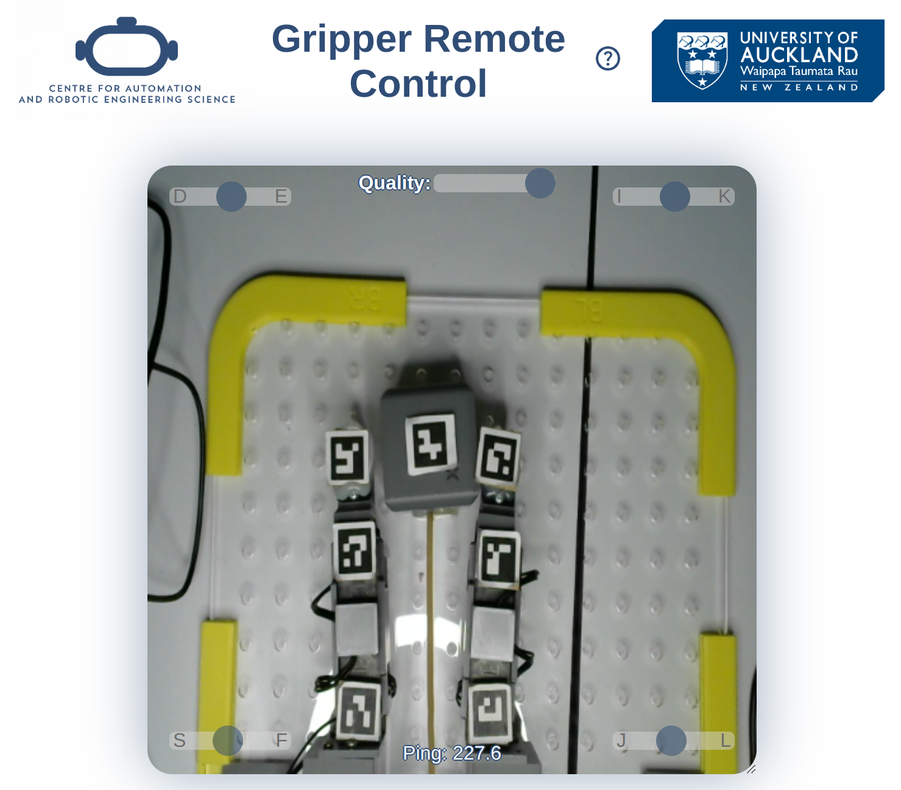

# Gripper Remote Control
Small tool for remote controlling the [CARES Gripper](https://github.com/UoA-CARES/Gripper-Code) by hand

## Control
- Use quality slider to reduce stream quality for better performance.
- Gripper can be controlled using the sliders or by pressing the specified keys.
- Press "H" to return to home position.

## Known problems:
- Currently only configured for 4-DoF-Gripper
- Gripper sometimes crashes. Although the application tries to restart it, this does not always work. If this occurs, please restart the application
